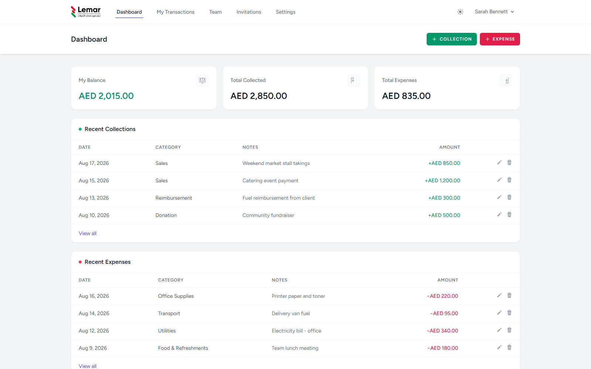

# Finlem

Finlem is a self-hosted petty cash tracker for teams. Members record their own cash collections and expenses, an admin gets a full financial overview across the team, and new people join through an admin-issued invitation link — or an account an admin creates for them directly.

Built with Laravel, Livewire (Volt), Tailwind CSS, and MySQL. Installable as a home-screen app on mobile and iOS.



## Features

- **Invite-only membership** — no public sign-up. Admins send an email invitation with a secure accept link, or create a member's account directly with a password of their choosing.
- **Personal cash tracking** — every member sees their own balance, total collected, total expenses, and a filterable, paginated history of collections and expenses, sorted by date.
- **Admin team overview** — organization-wide totals plus a per-member breakdown; admins can drill into any member's full transaction history.
- **Member management** — admins can edit a member's name, email, password, and role, or deactivate an account, all from one screen.
- **Custom categories** — admins maintain the list of collection and expense categories from a Settings page; members pick from a dropdown when recording a transaction.
- **Light / dark mode** — a manual toggle, persisted per device, defaulting to light.
- **Configurable currency** — set once via `.env`, formatted consistently everywhere.
- **Mobile-first UI** — a bottom tab bar and card-based lists on small screens, full desktop navigation and tables on larger ones. Supports "Add to Home Screen" on iOS/Android for an installable, standalone app experience.

## Tech stack

| Layer      | Choice                                  |
|------------|------------------------------------------|
| Backend    | Laravel 12                               |
| Frontend   | Livewire 3 (Volt single-file components) |
| Styling    | Tailwind CSS 3                           |
| Database   | MySQL                                    |
| Auth       | Laravel Breeze (Livewire stack)          |

## Installation

### Requirements

- PHP 8.2+
- Composer
- Node.js 20+ and npm
- MySQL 8+ (or MariaDB)

### Setup

```bash
git clone git@github.com:aliatayee/Finlem.git
cd Finlem

composer install
npm install

cp .env.example .env
php artisan key:generate
```

Edit `.env` and set your database credentials:

```env
DB_CONNECTION=mysql
DB_HOST=127.0.0.1
DB_PORT=3306
DB_DATABASE=finlem
DB_USERNAME=root
DB_PASSWORD=
```

Then create the database, migrate, and seed an initial admin account plus the default categories:

```bash
mysql -u root -e "CREATE DATABASE finlem CHARACTER SET utf8mb4 COLLATE utf8mb4_unicode_ci;"
php artisan migrate --seed
```

Build the front-end assets and start the app:

```bash
npm run build
php artisan serve
```

Visit `http://127.0.0.1:8000` and log in with the seeded admin account:

```
Email:    admin@finlem.test
Password: password
```

**Change this password immediately after your first login.**

### Local development

For active development, run Vite in watch mode alongside the PHP server:

```bash
npm run dev
php artisan serve
```

### Sending real invitation emails

By default `MAIL_MAILER=log`, so invitation emails are written to `storage/logs/laravel.log` instead of being sent — useful for local development, and the admin can still copy the invite link directly from the Invitations page. To actually deliver emails, configure a real mail driver (e.g. SMTP) in `.env`.

### Running tests

```bash
php artisan test
```

## Configuration

| Variable        | Purpose                                              | Default |
|------------------|-------------------------------------------------------|---------|
| `APP_CURRENCY`   | Currency code used for all displayed amounts          | `AED`   |
| `MAIL_MAILER`    | Set to `smtp` (with credentials) to send real invitation emails | `log` |

## License

This project is proprietary software. All rights reserved.
